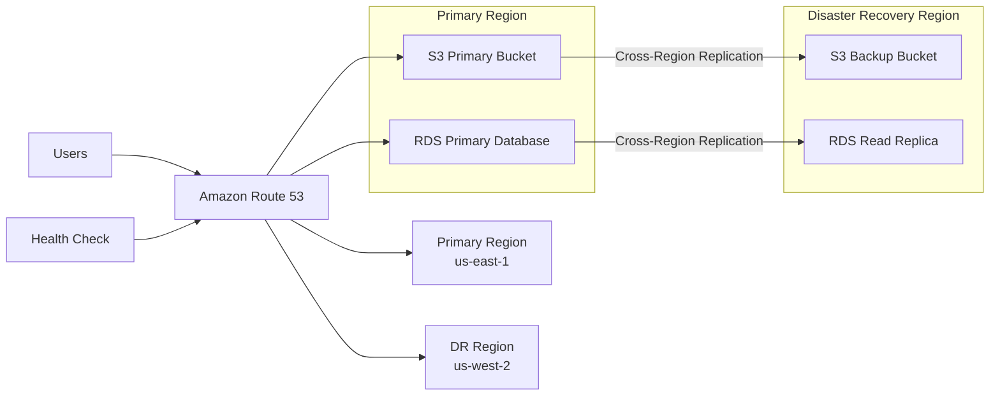
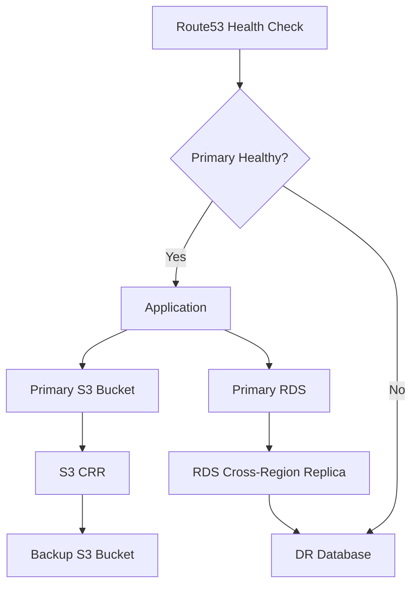

# Multi-Region Disaster Recovery Plan using Amazon S3 CRR & Amazon RDS Cross-Region Read Replica

## Overview

This project demonstrates the implementation of a **Multi-Region Disaster Recovery (DR) Strategy** on AWS using:

- Amazon S3 Cross-Region Replication (CRR)
- Amazon RDS Cross-Region Read Replica
- Amazon Route 53 Failover Routing
- Automated Health Checks
- Multi-AZ Deployment

The solution ensures business continuity, minimizes downtime, and enables rapid failover during regional outages.

---

# Architecture Diagram



---

# High-Level Disaster Recovery Architecture

```text
                Users
                   │
                   ▼
             Amazon Route 53
                   │
     ┌─────────────┴─────────────┐
     │                           │
     ▼                           ▼
Primary Region            DR Region
(us-east-1)               (us-west-2)

S3 Bucket  ─────────►  S3 Backup Bucket
      CRR Replication

RDS Primary ────────► RDS Read Replica
     Cross-Region Replication
```

---

# End-to-End Workflow



---

# Disaster Recovery Components

| Service | Purpose |
|----------|----------|
| Amazon S3 | Object Storage |
| S3 CRR | Cross-Region Replication |
| Amazon RDS | Database Hosting |
| RDS Read Replica | Disaster Recovery Database |
| Route 53 | DNS Failover |
| CloudWatch | Monitoring |
| IAM | Replication Permissions |
