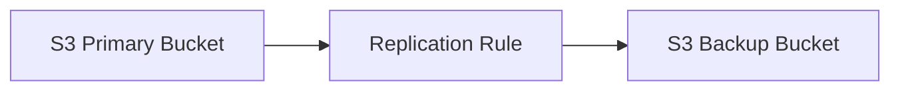
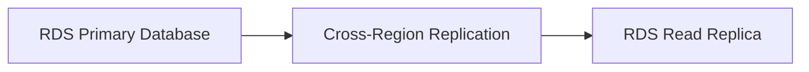
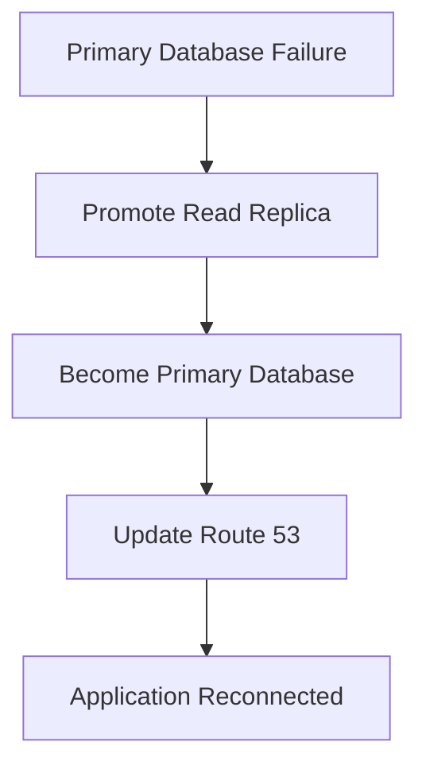
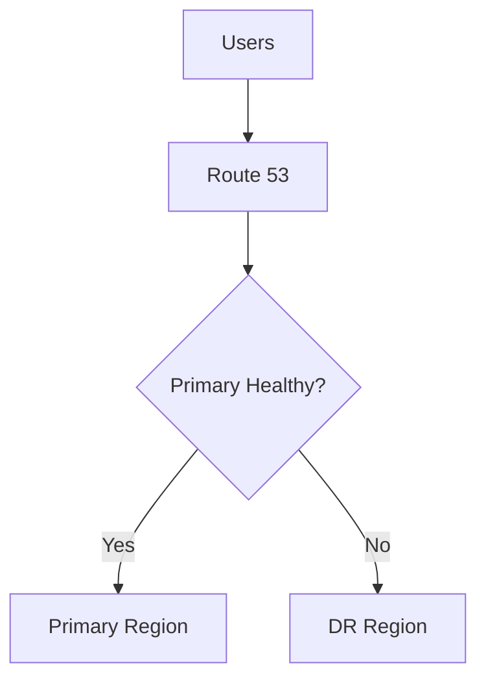
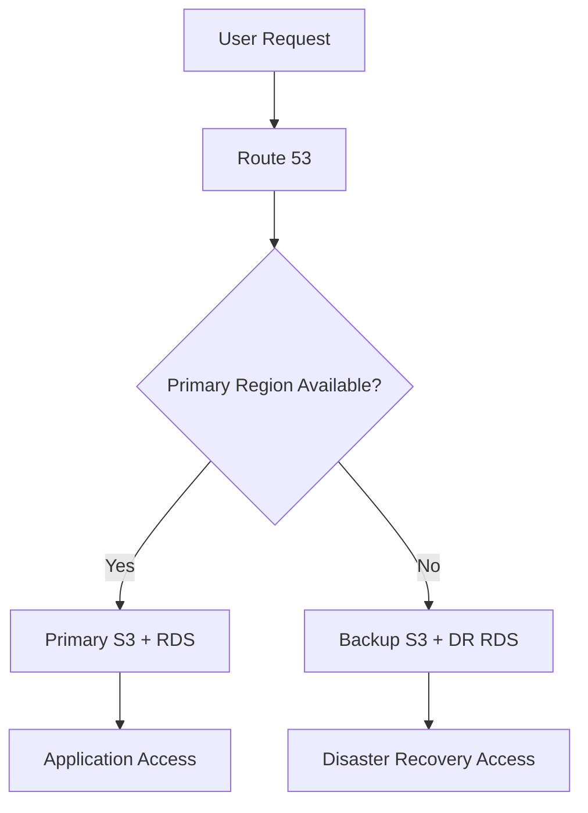

# Part 1: Configure Amazon S3 Cross-Region Replication (CRR)

---

# Step 1: Create S3 Buckets

## Navigation

```text
AWS Console
    │
    ▼
Amazon S3
    │
    ▼
Create Bucket
```

## Bucket Configuration

| Bucket Name | Region |
|-------------|---------|
| primary-bucket-us-east-1 | us-east-1 |
| backup-bucket-us-west-2 | us-west-2 |

---

## Enable Versioning

Versioning must be enabled on both buckets.

| Bucket | Versioning |
|----------|------------|
| Primary Bucket | Enabled |
| Backup Bucket | Enabled |

---

# Step 2: Configure IAM Role

## IAM Permissions Required

```json
{
  "Version": "2012-10-17",
  "Statement": [
    {
      "Action": [
        "s3:ReplicateObject",
        "s3:ReplicateDelete"
      ],
      "Effect": "Allow",
      "Resource": "*"
    }
  ]
}
```

---

## IAM Architecture

```text
Primary Bucket
       │
       ▼
IAM Replication Role
       │
       ▼
Backup Bucket
```

---

# Step 3: Enable Cross-Region Replication

## Navigation

```text
Amazon S3
    │
    ▼
Primary Bucket
    │
    ▼
Management
    │
    ▼
Replication Rules
```

---

## Replication Configuration

| Setting | Value |
|----------|---------|
| Source Bucket | primary-bucket-us-east-1 |
| Destination Bucket | backup-bucket-us-west-2 |
| Replication Type | Cross-Region Replication |
| IAM Role | S3ReplicationRole |
| Replica Modification Sync | Enabled (Optional) |

---

## Replication Workflow



---

# Step 4: Validate S3 Replication

## Upload Test File

```bash
aws s3 cp test.txt s3://primary-bucket-us-east-1
```

---

## Verify Replication

```bash
aws s3 ls s3://backup-bucket-us-west-2
```

---

## Expected Result

```text
test.txt successfully replicated.
```

---

# Part 2: Configure Amazon RDS Cross-Region Read Replica

---

# Step 5: Create Primary RDS Instance

## Configuration

| Setting | Value |
|----------|---------|
| Region | us-east-1 |
| Deployment | Multi-AZ |
| Engine | MySQL/PostgreSQL |
| Automated Backups | Enabled |

---

## Architecture

```text
Application
      │
      ▼
Primary RDS
(Multi-AZ)
```

---

# Step 6: Enable Automated Backups

## Navigation

```text
RDS Console
    │
    ▼
Modify Database
    │
    ▼
Automated Backups
```

---

## Configuration

| Setting | Value |
|----------|---------|
| Automated Backup | Enabled |
| Backup Retention | 7-35 Days |

---

# Step 7: Create Cross-Region Read Replica

## Navigation

```text
Amazon RDS
    │
    ▼
Actions
    │
    ▼
Create Read Replica
```

---

## Replica Configuration

| Setting | Value |
|----------|---------|
| Source Region | us-east-1 |
| DR Region | us-west-2 |
| Replication Type | Cross-Region |
| Monitoring | Enabled |

---

## Replication Architecture



---

# Step 8: Configure Failover

## Failover Procedure

When the primary region fails:

1. Promote Read Replica.
2. Convert Replica to Standalone Database.
3. Update Application Connection Strings.
4. Redirect Traffic via Route 53.

---

## Failover Workflow



---

# Part 3: Configure Route 53 Failover Routing

---

# Step 9: Create Route 53 Health Checks

## Route 53 Configuration

| Setting | Value |
|----------|---------|
| Routing Policy | Failover |
| Primary Endpoint | us-east-1 |
| Secondary Endpoint | us-west-2 |
| Health Check | Enabled |

---

## Route 53 Architecture



---

# Step 10: Test Disaster Recovery

## Test 1 – S3 Replication

```bash
aws s3 cp dr-test.txt s3://primary-bucket-us-east-1
```

Verify replication.

---

## Test 2 – RDS Read Replica

```sql
SELECT * FROM customers;
```

Verify consistency.

---

## Test 3 – Simulate Regional Failure

Actions:

```text
Stop Primary Database
Disable Application Access
Trigger Health Check Failure
```

---

## Expected Result

```text
Route 53 redirects traffic
to Disaster Recovery Region.
```

---

# Complete DR Workflow



---

# Security Best Practices Implemented

## Data Protection

| Control | Status |
|----------|---------|
| S3 Versioning | Enabled |
| Cross-Region Replication | Enabled |
| Automated Backups | Enabled |
| Multi-AZ Deployment | Enabled |
| Encryption at Rest | Enabled |
| Encryption in Transit | Enabled |

---

## Disaster Recovery Controls

| Control | Benefit |
|----------|----------|
| Cross-Region Replication | Data Availability |
| Read Replica | Database Recovery |
| Route 53 Failover | Automatic Redirection |
| Health Checks | Availability Monitoring |

---

# Validation Checklist

| Validation Item | Status |
|-----------------|---------|
| Primary S3 Bucket Created | ✅ |
| Backup S3 Bucket Created | ✅ |
| Versioning Enabled | ✅ |
| CRR Configured | ✅ |
| Primary RDS Created | ✅ |
| Multi-AZ Enabled | ✅ |
| Cross-Region Replica Created | ✅ |
| Route 53 Failover Configured | ✅ |
| Health Checks Created | ✅ |
| DR Testing Completed | ✅ |

---

# Project Outcome

Successfully implemented a Multi-Region Disaster Recovery architecture using Amazon S3 Cross-Region Replication, Amazon RDS Cross-Region Read Replicas, and Route 53 Failover Routing.

The solution provides high availability, rapid disaster recovery, and business continuity during regional outages.

---

# Impact

- Reduced Recovery Time Objective (RTO)
- Improved Recovery Point Objective (RPO)
- Increased application availability
- Enhanced disaster recovery readiness
- Improved business continuity
- Reduced risk of regional failures
- Automated DNS failover

---

# Technologies Used

| Category | Technology |
|------------|------------|
| Cloud Platform | AWS |
| Object Storage | Amazon S3 |
| Replication | S3 Cross-Region Replication |
| Database | Amazon RDS |
| High Availability | Multi-AZ |
| Disaster Recovery | Cross-Region Read Replica |
| DNS | Amazon Route 53 |
| Monitoring | Amazon CloudWatch |
| Security | AWS IAM |
| Governance | AWS Best Practices |
